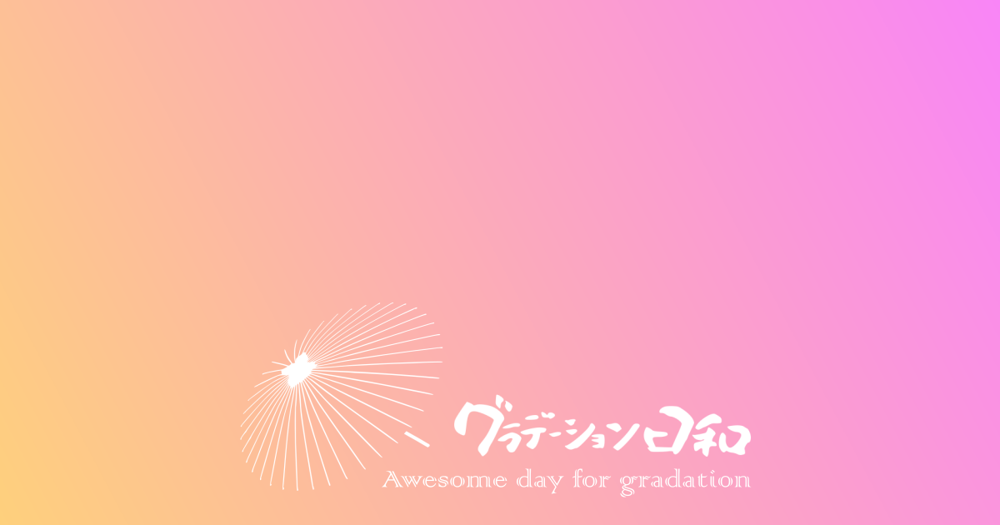

## グラデーション日和 とは？

グラデーション日和は CSS のグラデーションをクリックだけでかんたんに生成する Web サービスです。

グラデーションの繊細な調整や、 3 色以上のグラデーションを作ることはできませんが、シンプルな操作で直感的にグラデーションを作成することができます。

## 使い方

### グラデーションをコピー

12 色からメインとなる色をクリックし、後はクリックを繰り返すだけ。メインカラーをベースにしたグラデーションが生成されます。

ヘッダーのコピーアイコンをクリックすれば `linear-gradient(284deg,hsl(149,69%,73%),hsl(207,68%,22%))` のようなグラデーションのスタイルがクリップボードにコピーされます。

### シェア

グラデーションを作成してヘッダーの Twitter アイコンをクリックすれば、グラデーションを共有できます。

シェアされた URL からページを開くと、作成したグラデーションが表示されます。

## コントリビュート

Issues 、 Pull requests 、どちらも気軽にどうぞ。

